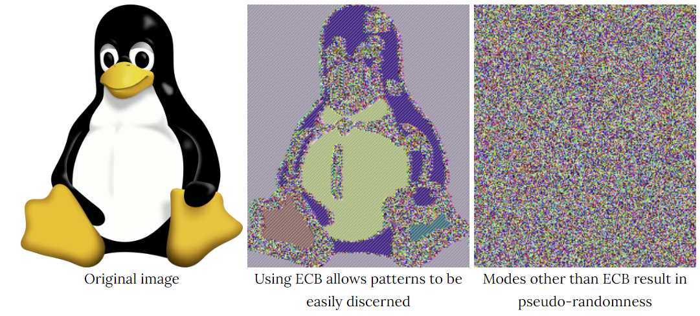

## ECB

## CBC

## CTR

## 錯誤

| 模式 | 在 CipherText 中的 bit 錯誤 | 在 IV 中的 bit 錯誤 |
| --- | --- | --- |
| ECB | 在解密后,Pi隨機比特錯誤 | - |
| CBC | 解密后，Pi隨機比特錯誤，Pi+1特定比特錯誤 | Pi隨機比特錯誤 |
| CTR | 解密后，Pi特定比特錯誤 | 看不懂 |
